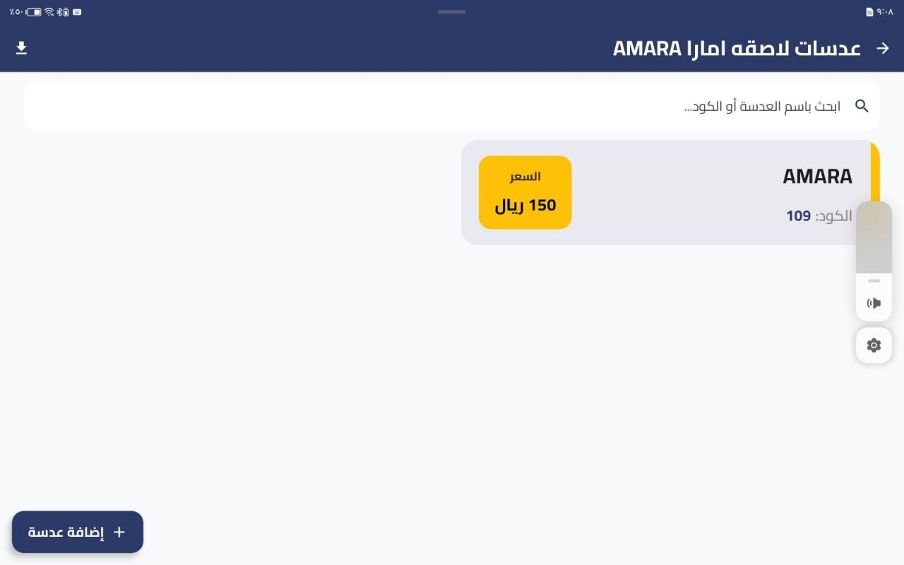
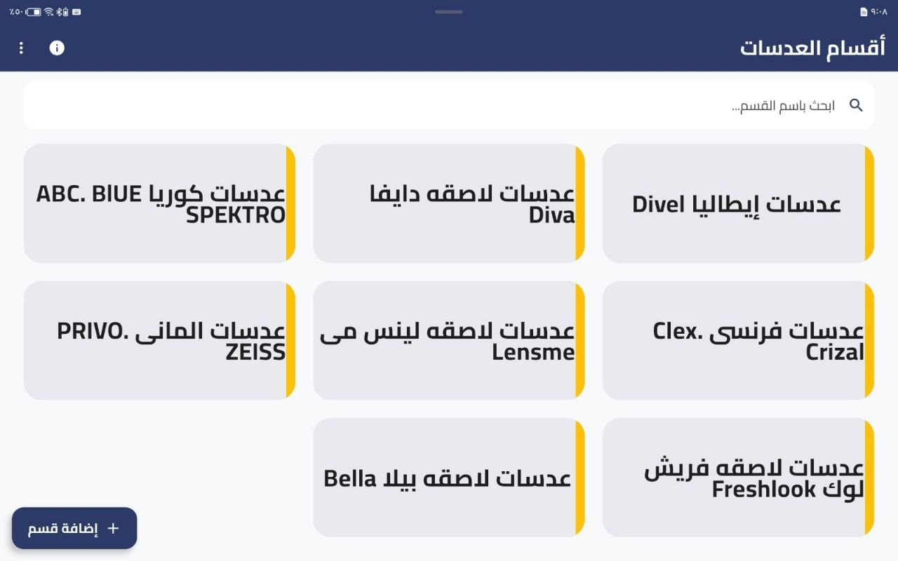
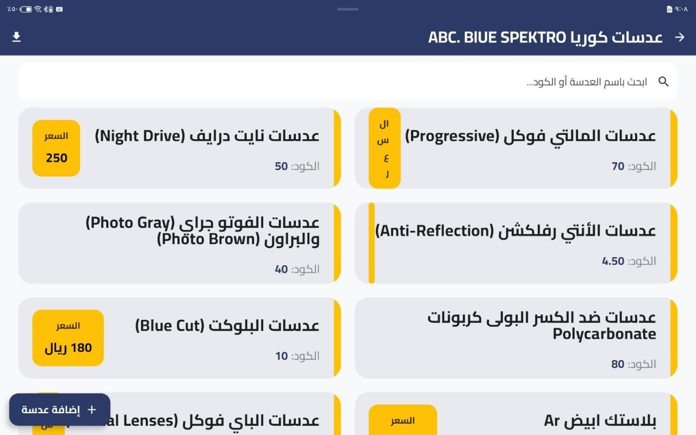
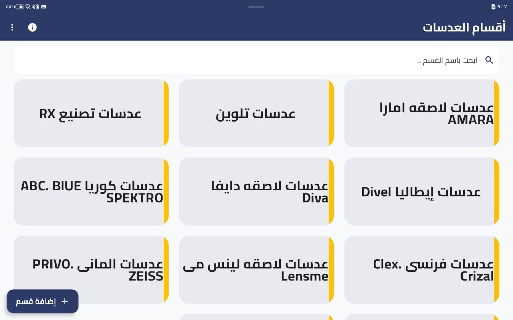
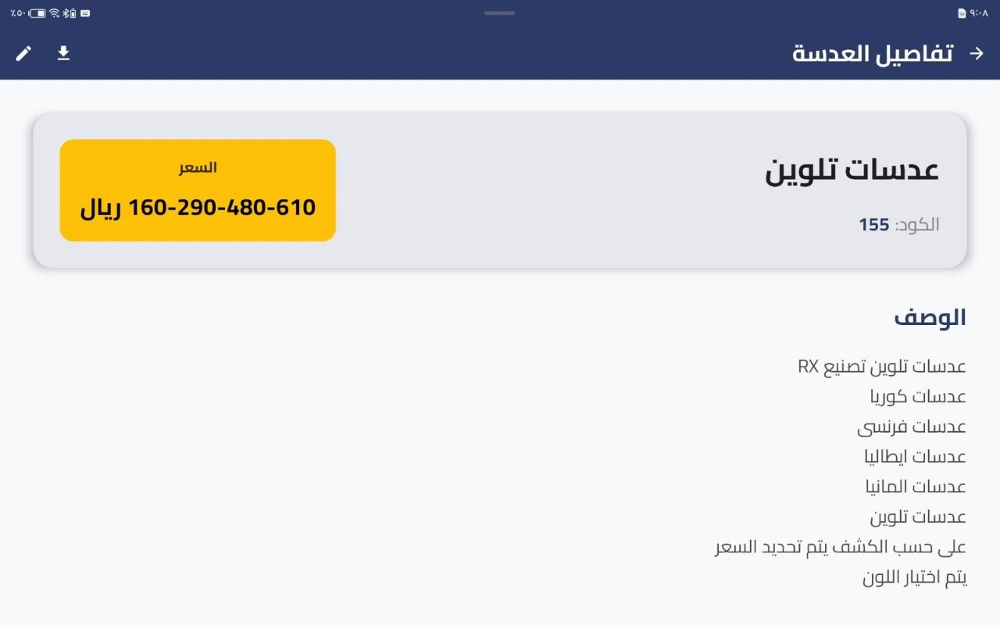
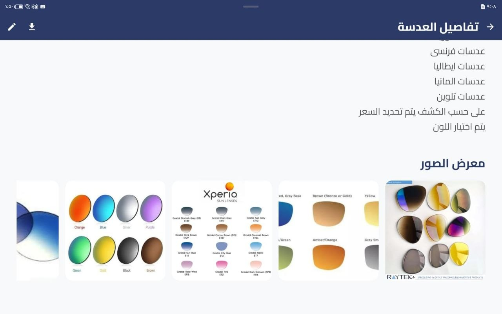
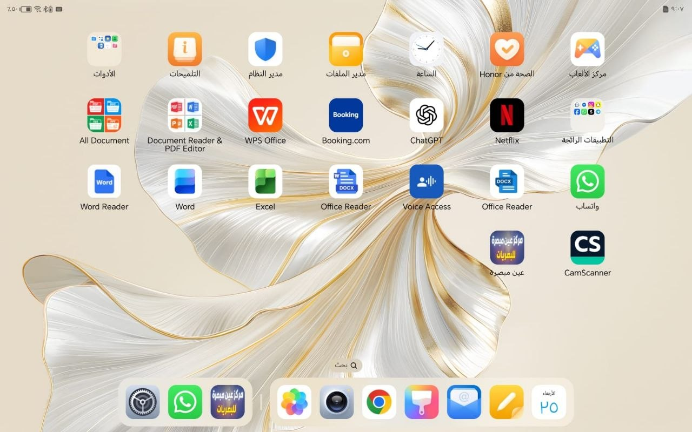
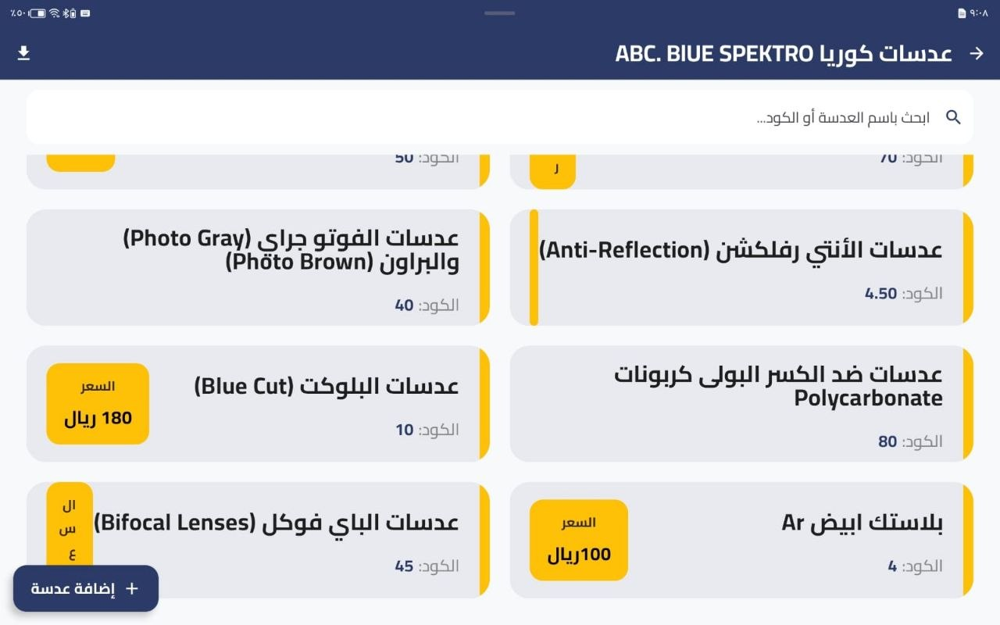
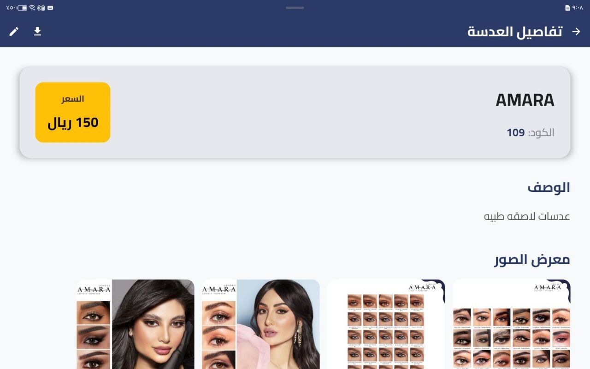

<h1 align="center">📱 Ain Mobsrah - Lens Management ERP</h1>

  <strong>A robust, enterprise-grade Android application tailored for optical centers to manage inventory, host product galleries, and generate dynamic PDF catalogs.</strong>

---

## 📖 Overview

**Ibsar** translates complex inventory data into a seamless mobile experience. Designed specifically for optical centers, the app allows administrators to categorize lenses, input detailed specifications, upload multiple high-resolution images, and export fully styled PDF catalogs directly from the device.

## ✨ Key Features

* **Advanced PDF Engine:** Programmatically generates professional PDF catalogs (spec sheets and grid layouts) with asynchronous image downloading and hardware-acceleration handling.
* **Smart Inventory Management:** Add, update, delete, and quick-edit lens data (Name, Code, Price, Description) across dynamically created categories.
* **Interactive Image Galleries:** Upload multiple images per product with full-screen, swipeable gallery support.
* **Real-Time Filtering:** Instant, state-driven search mechanism across categories and product codes.
* **Secure Authentication:** Integrated Firebase Auth supporting both Email/Password and **Google Sign-In**.
* **Modern UI/UX:** Fully responsive design adapting to mobile and tablet layouts, complete with system-aware Dark/Light mode.

## 🛠️ Tech Stack & Architecture

This project was built with scalability and maintainability in mind, strictly adhering to **Clean Architecture** principles and the **MVVM** design pattern.

* **Language:** Kotlin
* **UI Framework:** Jetpack Compose (Material Design 3)
* **Dependency Injection:** Dagger Hilt
* **Asynchronous Operations:** Kotlin Coroutines & StateFlow
* **Image Processing:** Coil
* **Backend as a Service (BaaS):** * Firebase Authentication
  * Cloud Firestore (NoSQL Database)
  * Firebase Cloud Storage
* **PDF Generation:** Native Android `PdfDocument` API

---

## 📸 Screenshots

<table style="width:100%">
  <tr>
    <td></td>
    <td></td>
    <td></td> 
  </tr>
  <tr>
    <td></td>
    <td></td>
    <td></td>
  </tr>
  <tr>
    <td></td>
    <td></td>
    <td></td>
  </tr>
  <tr>
    <td></td>
    <td></td>
    <td></td>
  </tr>
</table>

---

## ⚙️ Running the Project

To run this project locally, you need to configure your own Firebase environment:

1. Clone this repository.
2. Create a new project in the [Firebase Console](https://console.firebase.google.com/).
3. Enable **Authentication** (Email/Password & Google), **Firestore**, and **Storage**.
4. Download the `google-services.json` file and place it in the `app/` directory.
5. Add your machine's `SHA-1` and `SHA-256` keys to the Firebase project settings to enable Google Sign-In.
6. Build and run the project via Android Studio.

---

## 👨‍💻 Developer

Developed by **Eslam Ali**
* 📧 **Email:** [eslameng776@gmail.com]
* 🛠️ **Role:** Android Software Engineer
